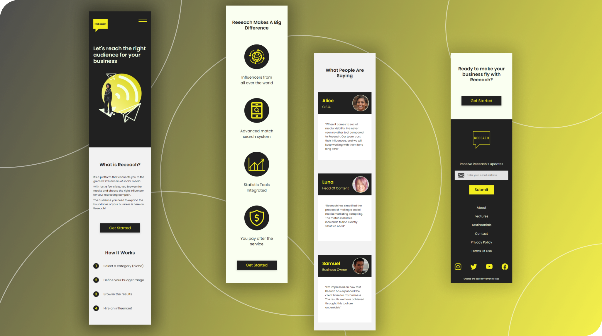
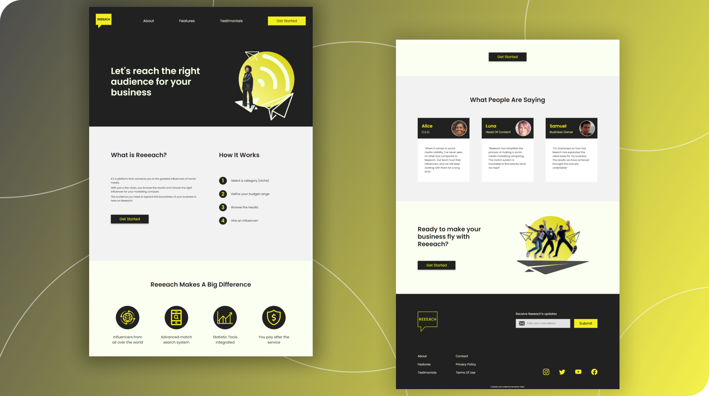

# Reeeach Landing Page

Este é um projeto pessoal de uma landing page para uma empresa fictícia chamada Reeeach.

## Índice

- [Overview](#overview)
  - [Sobre](#sobre)
  - [Funcionalidades](#funcionalidades)
  - [Layouts](#layouts)  
  - [Demonstração](#demonstração)
  - [Ferramentas](#ferramentas)
- [Autor](#autor)
- [Licença](#licença)

## Overview

### Sobre
Status: Concluído\
O objetivo desse projeto é praticar UI design (usando Figma) e habilidades de desenvolvimento front end.
É apenas uma Landing Page para uma empresa fictícia, chamada Reeeach (serviço conceitual para encontrar e contratar influenciadores digitais). 

### Funcionalidades
- Os usuários devem conseguir:
   - Navegar pela página e visualizar o layout de acordo com o tamanho de tela do dispositivo
   - Visualizar estados hover e focus para todos os elementos interativos da página 
   - Ver outras animações que são ativadas pelos seguintes eventos:
        - Abrir / Fechar (menu mobile)
        - Scroll (rolar) - Conforme o usuário entra em uma seção da página pela primeira vez, os elementos são animados        

### Layouts  

[Designs originais disponíveis no Figma](https://www.figma.com/file/itIPrw2fLlYAdGdEjNmE8q/Influencers-Landing-Page?node-id=32%3A2)

#### Mobile

#### Desktop

### Demonstração
[Ver demonstração do site](https://devtezza.github.io/reeeach/)

### Ferramentas

Layout:
- [Figma](https://www.figma.com) - wireframes e design

Ícones:
- [SVG Repo](https://www.svgrepo.com/) 
- [Bootstrap Icons](https://icons.getbootstrap.com/)

Imagens:
- [Unsplash](https://unsplash.com/) - Fotos sem direitos autorais
- [This Person Does Not Exist](https://thispersondoesnotexist.com/) - Gerador de avatar fake
- [Remove BG](https://www.remove.bg/) - Removedor de fundo

Código:
- HTML5, CSS3 and Javascript

Bibliotecas:
- [SASS](https://sass-lang.com/) - Preprocessador de CSS3 
- [Greensock (GSAP)](https://greensock.com/) - Biblioteca de Animação Javascript

## Autor

[Fernando Tezza](https://github.com/devtezza) \
[Linkedin](https://www.linkedin.com/in/devtezza/)  |  [Frontend Mentor](https://www.frontendmentor.io/profile/devtezza)

## Licença

Este projeto está sob a licença [MIT](./LICENSE) 

## Versões do README
[Português](./README-pt-br.md)  |  [Inglês](./README.md)