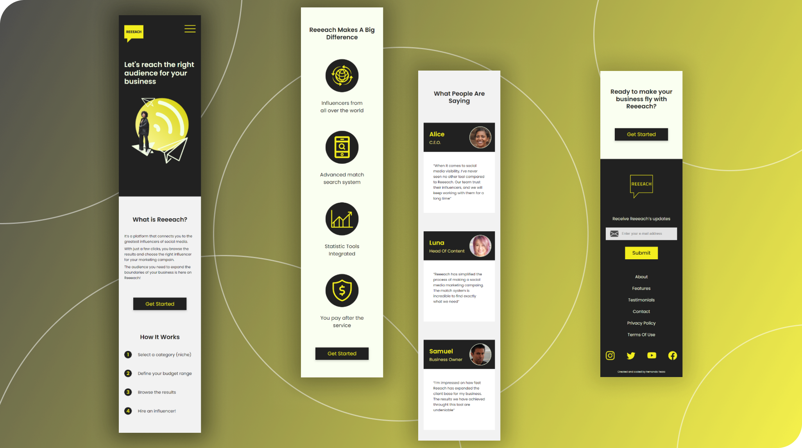
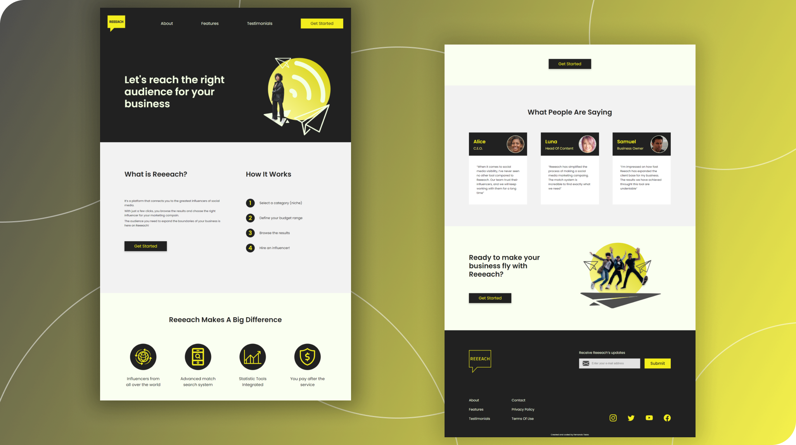

# Reeeach Landing Page

This is a personal project of a landing page for a fictional company called Reeeach.

## Table Of Contents

- [Overview](#overview)
  - [About](#about)
  - [Features](#features)
  - [Layouts](#layouts)  
  - [Live Site](#live-site)
  - [Tools](#tools)
- [Author](#author)
- [License](#license)

## Overview

### About
Status: Finished\
The purpose of this project is to practice UI design (using Figma) and front end development skills. It's just a Landing Page for a fictional company, called Reeeach (conceptual service to find and hire digital influencers).

### Features
- Users should be able to:
   - Navigate through the page and view its layout according to the device's screen size
   - See the hover states and focus states for all interactive elements on the page
   - See other animations that are triggered on the following events:
        - Open / Close (mobile menu)
        - Scrolling - As the user enter a page section for the first time, the elements are animated

### Layouts  

[The original designs are available on Figma](https://www.figma.com/file/itIPrw2fLlYAdGdEjNmE8q/Influencers-Landing-Page?node-id=32%3A2)

#### Mobile

#### Desktop

### Live Site
[Go to Live Site](https://nandotezza.github.io/reeeach/)

### Tools

Layout:
- [Figma](https://www.figma.com) - for wireframes and design

Icons:
- [SVG Repo](https://www.svgrepo.com/) 
- [Bootstrap Icons](https://icons.getbootstrap.com/)

Pictures:
- [Unsplash](https://unsplash.com/) - Royalty free photos
- [This Person Does Not Exist](https://thispersondoesnotexist.com/) - Fake Avatar Generator
- [Remove BG](https://www.remove.bg/) - Background remover

Code:
- HTML5, CSS3 and Javascript

Libraries:
- [SASS](https://sass-lang.com/) - CSS3 Preprocessor
- [Greensock (GSAP)](https://greensock.com/) - Javascript Animation Library

## Author

[Fernando Tezza](https://github.com/nandotezza) \
[Linkedin](https://www.linkedin.com/feed/)  |  [Frontend Mentor](https://www.frontendmentor.io/profile/nandotezza)

## License

This project is under the license [MIT](./LICENSE)

## README Versions
[Portuguese](./README-pt-br.md)  |  [English](./README.md)